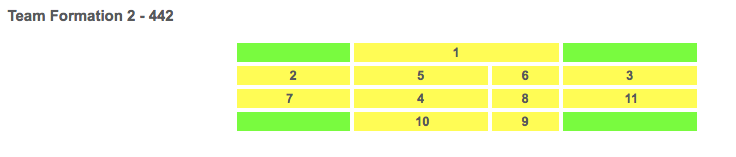
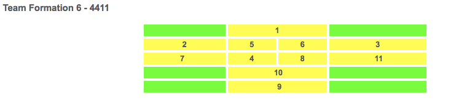
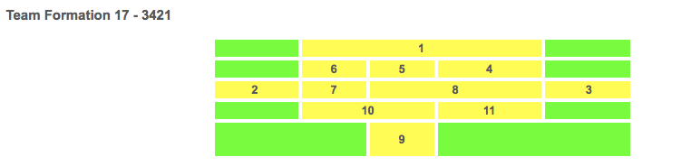

# Front-end Coding Challenge

## Task

Create a single-page application that displays a team's lineup and formation.

**Submissions must be version controlled and uploaded to either Github or Bitbucket.**

### Instructions

The lineup and formation data is made available by a HTTP API and WebSocket interface.

* The initial lineup and formation data should first be retrieved from the HTTP API endpoint. 
* After the data has been rendered on the page you should then use pusher ([https://pusher.com](https://pusher.com)) to listen for lineup updates using the channel/event details provided.
* Any updates to the lineup should then be displayed on the current lineup.

### Formations

The displayed lineup should scale-down gracefully and be rendered as a list for viewports with a width of 320px and below.

There are 3 possible formations across 5 possible rows including the goalkeeper: 

* 442
* 4411
* 3421

#### Formation diagrams







## Points to note

The possible match lineups and data structure is included in a [match-lineups.json](./match-lineups.json) file. The `formation_place` key corresponds to the numbers on the formation diagrams provided.

The lineup API endpoint can be found at: [http://lineups.dev.fantech.io](http://lineups.dev.fantech.io).

The pusher channel will be sent data every 20 seconds. The details for subscribing to pusher are: 

```
APP_KEY = 6a3acdaba86ad858948b 
APP_CLUSTER = eu 
Channel = lineups 
Event = lineup-updated
```

For this challenge, you may use any library or tools you wish. Vue or React would be a good choice combined with a HTTP client library, such as Axios, and Pusher. 

This test is not time limited, however please **only use a responsible amount of time** on the project.

You will not be judged on your design skills for this task, **usability and accessibility are more important**.

An image of a football pitch has been provided to use as the formation background – this is not a requirement should you wish to use a different design.

## Thing to consider

* React or VueJS
* Webpack/Build tools
* CSS Pre-processors (SASS, PostCSS, Less)
* Unit testing/TDD